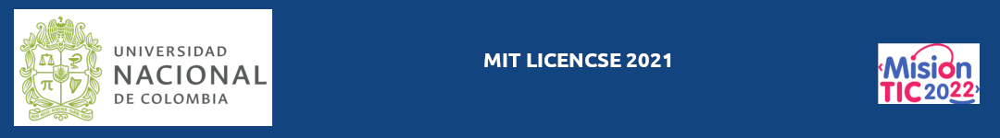

# Progressive Web Aplication

---

Author:

- FS

Date: 2021

## TABLA DE CONTENIDO

---

1. [Descripción](#Descripción)
2. [Organización del proyecto](#Organizacion)
3. [Como ejecutar la aplicacion](#eAplicacion)
4. [Licencia](#Licencia)
5. [Agradecimientos](#Agradecimientos)

## DESCRIPCIÓN

---

Desarrollo de un "Hola mundo" de una _Progressive Web Aplication_(PWA)

## ORGANIZACION DEL PROYECTO

---

El proyecto se encuentra conformado por la siguiente estructura de directorios y archivos (los más relevantes a la aplicación):

```
.
├── docs
├── HolaMundo
│   ├── css
│   │   └── style.css
│   ├── image
│   └── js
│       └── main.js
├── index.html
├── manifest.json
├── README.md
└── sw.js
```

## LICENCIA

Este proyecto se encuentra publicado bajo la licencia MIT. En [este enlace](https://opensource.org/licenses/MIT) podrá encontrar más información sobre la misma.

